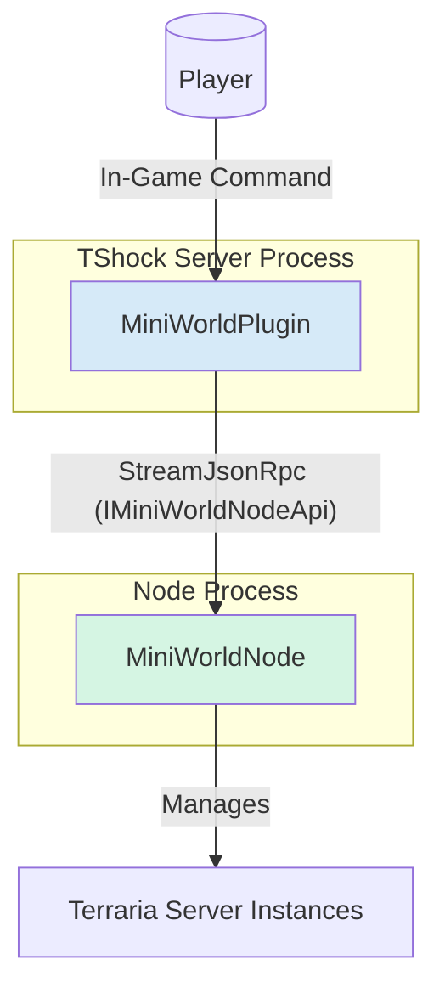

# MiniWorld 架构设计文档

## 1. 引言

本文档旨在阐述 `MiniWorld` 插件系统重构后的架构设计。

旧的架构基于复杂的事件驱动模型在主插件 (`MiniWorldPlugin`) 和工作节点 (`MiniWorldNode`) 之间进行通信。为了简化实现、提高可维护性，我们采用 `StreamJsonRpc` 对通信层进行重构。

新的设计基于以下核心原则：

- **简化**: 只允许存在一个工作节点，大幅简化节点管理和状态同步逻辑。
- **可靠**: 基于 `StreamJsonRpc` 提供稳定、双向的远程过程调用，替代原有的单向事件推送。
- **清晰**: 将所有通信协定统一到共享库 `MiniWorld.Shared` 中，使得接口和模型定义清晰明了。
- **环境**: 整个系统设计用于可信任的网络环境，因此简化了安全和认证相关的机制。

## 2. 核心组件

新架构主要由以下三个项目组成：

- **`MiniWorldPlugin`**: 作为运行在 TShock 服务端的主插件。它负责处理玩家的游戏内指令、管理微型世界（MiniWorld）的元数据，并通过 RPC 调用与 `MiniWorldNode` 通信来执行具体的服务器操作。

- **`MiniWorldNode`**: 一个独立的 .NET 控制台应用程序。它作为唯一的工作节点，负责管理和运行实际的 Terraria 游戏服务器进程。它接收来自 `MiniWorldPlugin` 的 RPC 指令，执行如启动、停止、管理地图等操作，并返回结果。

- **`MiniWorld.Shared`**: 一个共享类库，包含了主插件和工作节点之间通信所需的所有定义。这是解耦两个核心组件的关键，主要内容包括：
  - **RPC 接口**: `IMiniWorldNodeApi` 接口，定义了所有可被调用的远程方法。
  - **数据模型**: 如 `MiniWorld`、`NodeInfo`、`GameServerInfo` 等，用于在通信过程中传递数据。
  - **命令对象**: 如 `StartServerCommand`，用于封装 RPC 调用的参数。

## 3. 通信协议

主插件与工作节点之间的通信完全基于 `StreamJsonRpc`。

- **连接**: 系统启动时，`MiniWorldPlugin` 会作为客户端，主动连接到 `MiniWorldNode` 提供的 RPC 服务端点（例如 WebSocket 或命名管道）。
- **调用**: 连接建立后，双方即可通过代理对象进行远程方法调用，如同调用本地方法一样，无需关心底层的序列化和网络传输细节。
- **方向**: 目前的设计主要是由 `MiniWorldPlugin` 调用 `MiniWorldNode` 提供的方法。但 `StreamJsonRpc` 支持双向调用，未来也可以轻松扩展为节点主动向插件推送通知。

## 4. RPC 接口 (`IMiniWorldNodeApi`)

所有节点可执行的操作都被定义在 `IMiniWorldNodeApi` 接口中，主要方法包括：

- `Task<NodeInfo> GetNodeInfoAsync()`: 获取当前工作节点的状态信息。
- `Task<GameServerInfo> StartServerAsync(StartServerCommand command)`: 根据指定参数启动一个新的游戏服务器实例。
- `Task<bool> StopServerAsync(StopServerCommand command)`: 停止一个正在运行的游戏服务器。
- `Task<GameServerInfo?> GetServerInfoAsync(string serverId)`: 查询指定 ID 的游戏服务器状态。
- `Task<string[]> ListMapsAsync(int creatorUserId)`: 列出指定用户的所有可用地图。
- `Task<bool> CreateMapAsync(int creatorUserId, string mapName)`: 创建一个新地图。
- `Task<bool> DeleteMapAsync(int creatorUserId, string mapName)`: 删除一个已有的地图。
- `Task<bool> CopyMapAsync(...)`: 复制地图。

## 5. 工作流程示例：启动一个新世界

1.  **玩家请求**: 玩家在游戏内输入指令，请求启动一个新的微型世界。
2.  **插件处理**: `MiniWorldPlugin` 接收到指令，`WorldManager` 准备好 `StartServerCommand` 所需的参数（如地图名、服务器 ID 等）。
3.  **RPC 调用**: `WorldManager` 通过 `StreamJsonRpc` 的代理对象，调用 `IMiniWorldNodeApi.StartServerAsync(command)` 方法。
4.  **节点执行**: `MiniWorldNode` 接收到 RPC 请求，`GameServerManager` 开始执行服务器启动逻辑：创建进程、准备参数、启动 `TerrariaServer.exe`。
5.  **返回结果**: 服务器进程成功启动后，`MiniWorldNode` 将包含端口、进程 ID 等信息的 `GameServerInfo` 对象作为 RPC 调用的结果返回。
6.  **状态更新**: `MiniWorldPlugin` 接收到返回的 `GameServerInfo`，更新数据库中对应 `MiniWorld` 的状态为 "Online"，并通知玩家连接信息。

## 6. 架构图

